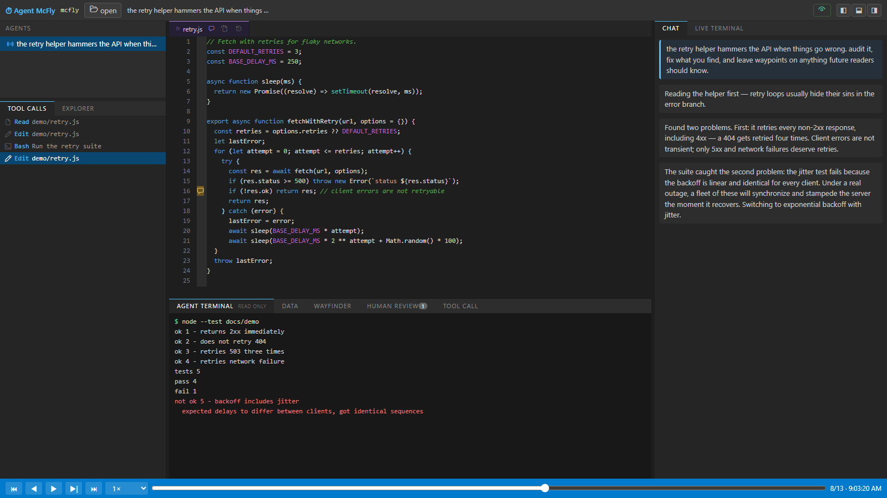
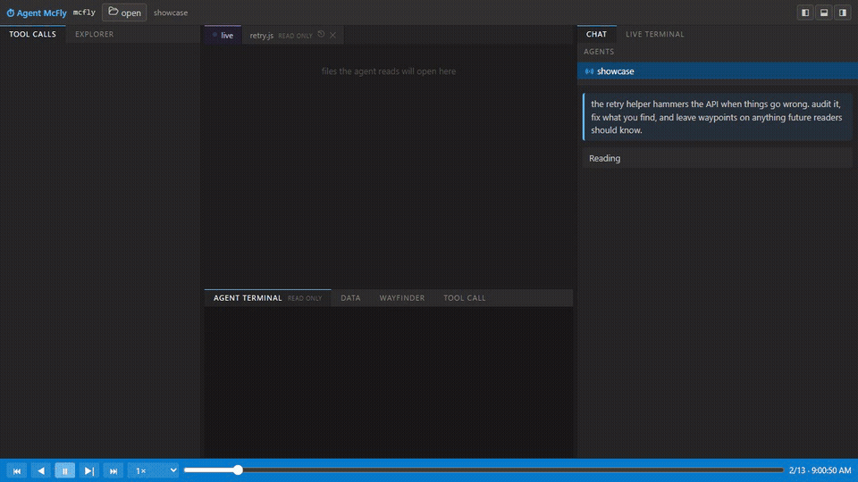
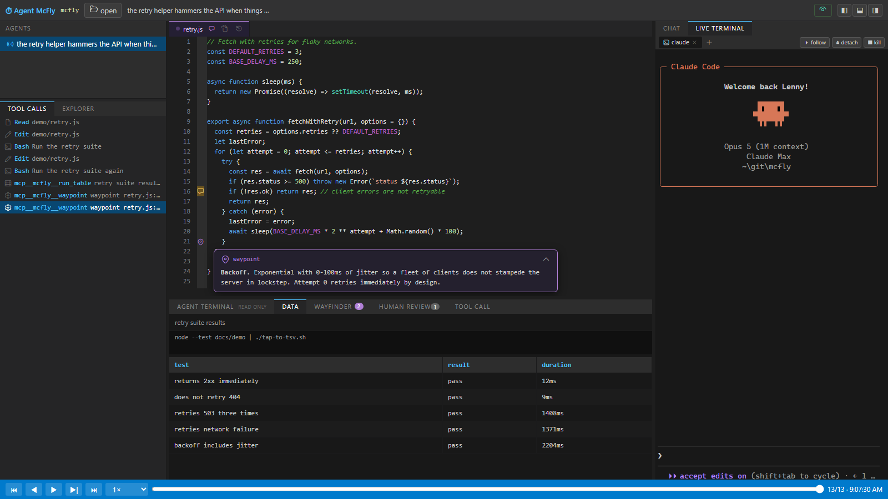
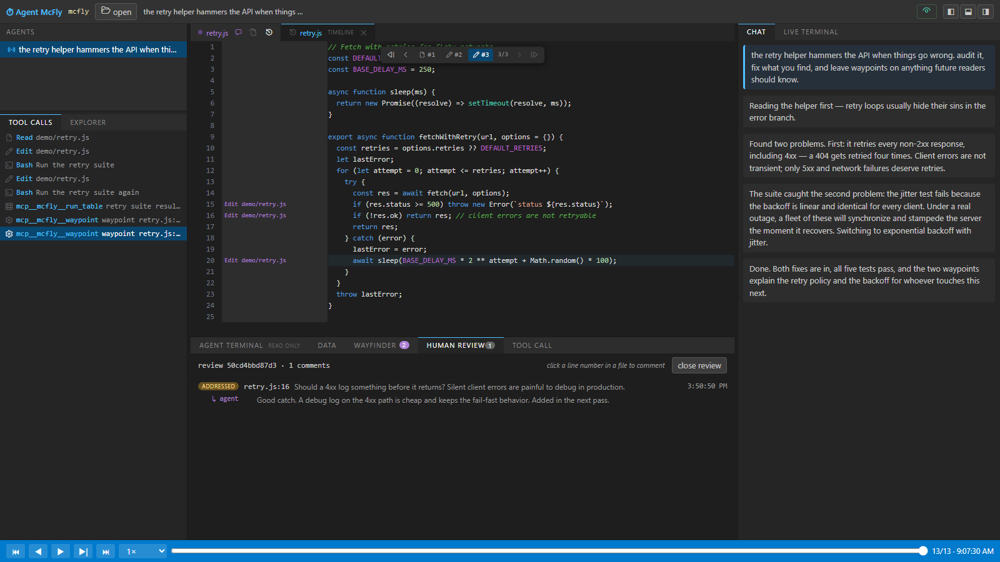
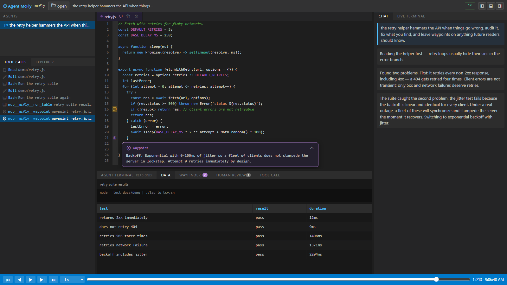
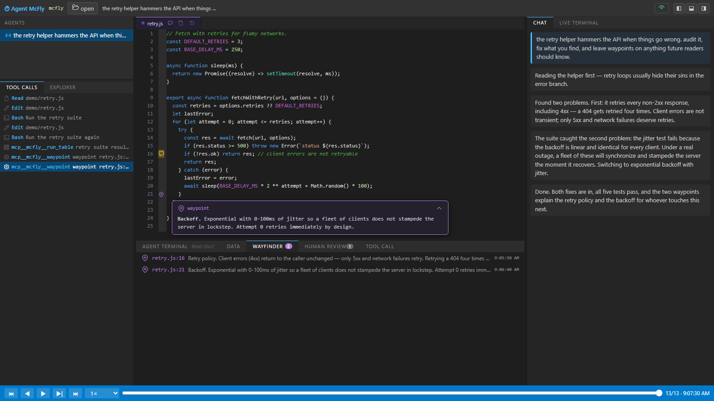
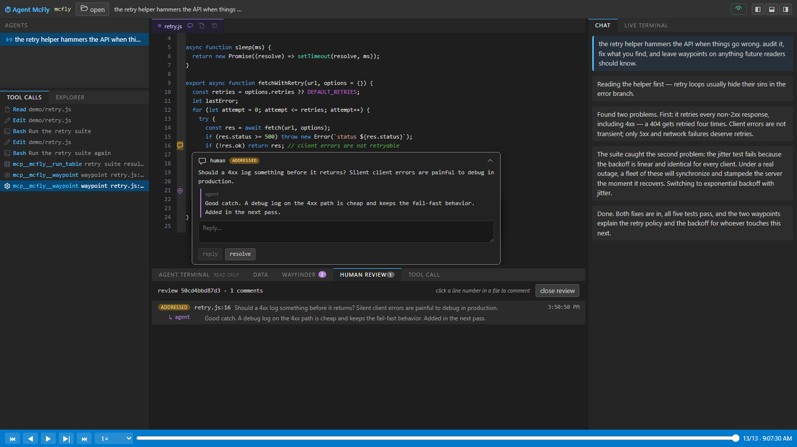

# Agent McFly

Agent McFly is a browser workbench for Codex and Claude Code sessions. It replays completed sessions step by step, and it follows live sessions while they run. You can start an agent in a McFly terminal, see its session live, and talk to the agent in the same window. The workbench shows the chat, the tool calls, the file changes, and the terminal output. All panes show the same step.



## Quick start

```bash
npx agent-mcfly
```

The server starts on port 7777 and opens the browser.

| Flag | Function |
|---|---|
| `-p`, `--port <port>` | Set the server port. |
| `--no-open` | Do not open the browser. |
| `-v`, `--version` | Show the version. |

## The workbench

**Replay.** The workbench plays a session step by step. The chat, the editor, and the terminal always show the same step. You can move the playhead to each step. You can click a message, a tool call, or a line of code to go to its step. The tour guide toggle controls the view. When the toggle is on, the view goes to each new item. When the toggle is off, the tab of the item flashes.



**Live sessions.** McFly follows an agent while it works. You can also start the agent in a McFly terminal. Then one window shows the session and the terminal that controls it.



**File history.** The editor shows each file with the content that the agent read or wrote at the current step. You can also open a timeline view for a file. The timeline view opens as a separate tab. It shows each change to the file from the session, with the source step for each line.



## Agent tools (MCP)

Configure the McFly MCP for local agents:

```bash
mcfly mcp config
```

This command writes `~/.mcfly/mcp.json`. When Codex and Claude Code are installed, the command also adds the MCP to them.

The MCP gives agents these tools:

| Tool | Function |
|---|---|
| `run_table` | Runs a Bash script and shows its strict TSV output as a table in the DATA tab. |
| `highlight` | Opens a file in the workbench with the given lines highlighted. |
| `waypoint` | Marks a line with a note. |
| `waypoint_remove` | Removes waypoints from a file. |
| `workspace_state` | Gives the agent the open files, the visible lines, and the selections of the user. |
| `review_state` | Reads the open human reviews and their comment threads. |
| `review_reply` | Replies to a review comment, and can mark it addressed. |



**Waypoints.** An agent can attach a note to a line of code. The wayfinder lists the notes. A note stays on its line after the file changes. If the line is deleted, a snapshot shows the line and its old context.



**Human review.** You can add a comment to a line, the same as in a pull-request review. Click a line number, or drag along the line numbers to select a range. Agents read the comment threads and reply through the MCP. Each thread has one of three states: open, addressed, or resolved. A review belongs to one session. The reviews stay on disk as JSON files.



## Run from source

```bash
npm ci
npm ci --prefix ui
npm run build
npm start
```

## Release

Add an `NPM_TOKEN` secret to the GitHub repository. Then create and push a semantic-version tag:

```bash
git tag v0.0.1
git push origin v0.0.1
```

GitHub Actions runs the checks. Then it updates the package version and publishes the package.

## License

MIT
